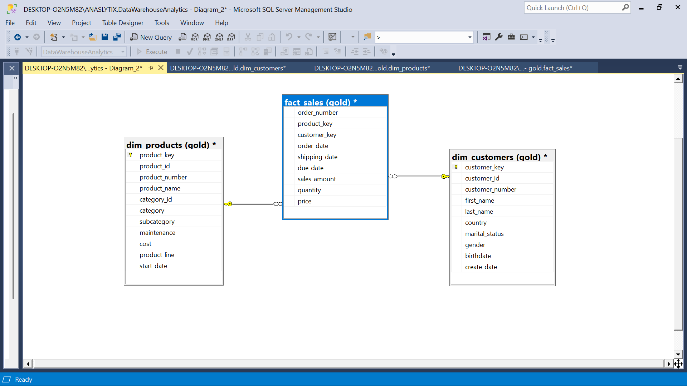
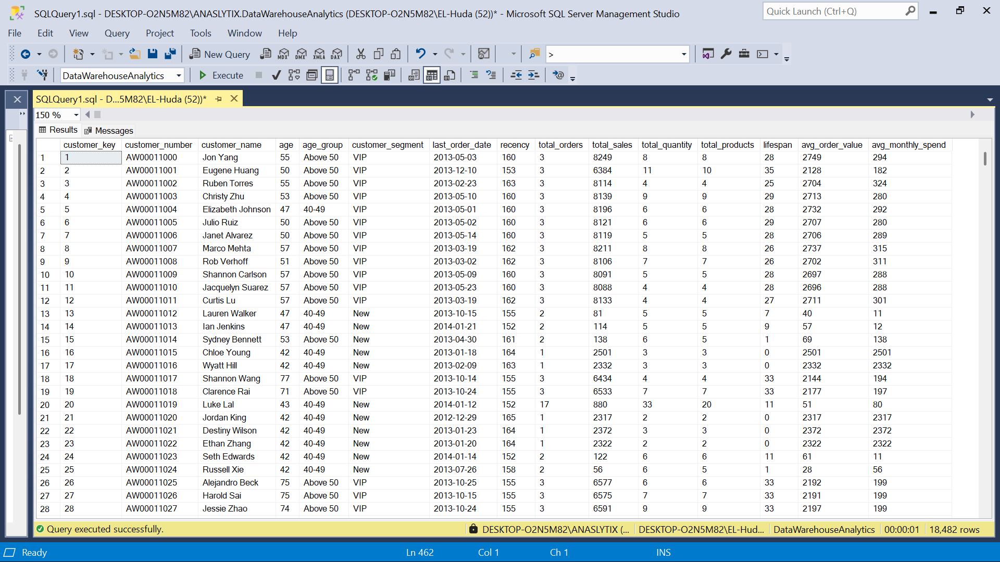
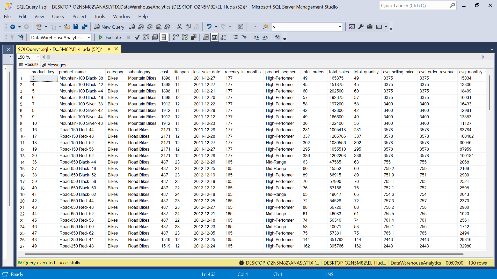

# SQL Data Analytics Project

A practical SQL Data Analytics project built using **Microsoft SQL Server** to analyze sales performance, customer behavior, and product performance.

The project demonstrates how raw sales data can be structured into a simple **Star Schema** and analyzed using SQL techniques such as aggregations, CTEs, window functions, date functions, customer segmentation, and analytical reporting.

---

## Project Overview

This project uses three main tables:

* `gold.dim_customers` — Customer information and demographic attributes.
* `gold.dim_products` — Product, category, subcategory, and cost information.
* `gold.fact_sales` — Sales transactions including orders, dates, quantities, prices, and sales amounts.

The project covers the complete analytical workflow from database creation and data loading to exploratory analysis and reusable customer and product reports.

### Key Analytical Areas

* Sales performance over time
* Monthly sales and customer trends
* Cumulative sales and moving averages
* Year-over-Year (YoY) product performance
* Product performance compared with average sales
* Category contribution to total sales
* Product cost segmentation
* Customer segmentation
* Customer-level KPIs
* Product-level KPIs

---

## Data Warehouse Schema

The project follows a simple **Star Schema** consisting of one fact table and two dimension tables.

### Fact Table

`gold.fact_sales`

Contains transactional sales data such as:

* Order number
* Product key
* Customer key
* Order date
* Shipping date
* Due date
* Sales amount
* Quantity
* Price

### Dimension Tables

`gold.dim_customers`

Contains customer attributes including:

* Customer ID
* Customer number
* Name
* Country
* Marital status
* Gender
* Birthdate
* Create date

`gold.dim_products`

Contains product attributes including:

* Product ID
* Product number
* Product name
* Category
* Subcategory
* Cost
* Product line
* Start date



---

## Analysis

The project includes several analytical queries designed to evaluate sales, customer, and product performance.

### Sales Performance Over Time

Monthly sales analysis was used to calculate:

* Total sales
* Number of unique customers
* Total quantity sold

### Cumulative Sales & Moving Average

Window functions were used to calculate:

* Monthly total sales
* Running total sales
* Moving average price

### Year-over-Year Product Analysis

Product sales were analyzed by year and compared against:

* The product's average sales performance
* Previous year's sales

This includes:

* Difference from average sales
* Above/Below average classification
* Previous-year sales
* Year-over-Year difference
* Increase/Decrease classification

### Category Contribution

Categories were ranked according to their contribution to overall sales.

The analysis calculates:

* Category total sales
* Overall sales
* Percentage contribution to total sales

### Product Cost Segmentation

Products were grouped into cost ranges:

* Below 100
* 100–500
* 500–1000
* Above 1000

### Customer Segmentation

Customers were classified based on their spending and relationship duration:

* **VIP** — At least 12 months of history and spending above 5,000
* **Regular** — At least 12 months of history and spending 5,000 or less
* **New** — Less than 12 months of history

---

## Customer Report

The customer report is implemented as the reusable SQL view:

`gold.report_customers`

It consolidates customer-level information and behavioral metrics.

### Customer Metrics

The report includes:

* Customer name
* Age
* Age group
* Customer segment
* Last order date
* Recency
* Total orders
* Total sales
* Total quantity
* Total products
* Customer lifespan
* Average Order Value (AOV)
* Average monthly spend

### Customer Segmentation

Customers are classified into:

`VIP`, `Regular`, and `New`

based on their lifespan and total spending.



---

## Product Report

The product report is implemented as the reusable SQL view:

`gold.report_products`

It provides product-level performance metrics and behavioral indicators.

### Product Metrics

The report includes:

* Product name
* Category
* Subcategory
* Cost
* Product lifespan
* Last sale date
* Recency
* Product segment
* Total orders
* Total customers
* Total sales
* Total quantity sold
* Average selling price
* Average order revenue
* Average monthly revenue

### Product Segmentation

Products are classified according to total sales:

* **High-Performer** — Sales above 50,000
* **Mid-Range** — Sales from 10,000 to 50,000
* **Low-Performer** — Sales below 10,000



---

## SQL Implementation

The project uses Microsoft SQL Server to create the database, schema, tables, load the source CSV files, perform analysis, and create reusable analytical views.

The implementation includes:

* Database and schema creation
* Dimension and fact table creation
* CSV data loading using `BULK INSERT`
* Exploratory and analytical SQL queries
* Common Table Expressions (CTEs)
* Window functions
* Aggregations
* Date calculations
* Conditional logic
* Customer segmentation
* Product segmentation
* Analytical SQL views


---

## SQL Techniques Demonstrated

The project demonstrates practical SQL techniques including:

* `CREATE DATABASE`
* `CREATE SCHEMA`
* `CREATE TABLE`
* `BULK INSERT`
* `CREATE VIEW`
* `SELECT`
* `JOIN`
* `LEFT JOIN`
* `GROUP BY`
* `ORDER BY`
* `CASE`
* Common Table Expressions (CTEs)
* Window functions
* `SUM() OVER()`
* `AVG() OVER()`
* `LAG()`
* `COUNT(DISTINCT)`
* `FORMAT()`
* `DATETRUNC()`
* `YEAR()`
* `DATEDIFF()`
* `ROUND()`
* `NULLIF()`
* Customer and product segmentation
* Running totals
* Moving averages
* Year-over-Year analysis

---

## Repository Structure

```text
sql-data-analytics-project/
│
├── data/
│   ├── dim_customers.csv
│   ├── dim_products.csv
│   └── fact_sales.csv
│
├── images/
│   ├── customer_report.png
│   ├── product_report.png
│   ├── schema.png
│   └── sql_script.png
│
└── sql/
    └── data_analytics.sql
```

---

## How to Run

### Requirements

* Microsoft SQL Server
* SQL Server Management Studio (SSMS)
* The CSV files included in the `data/` directory

### Steps

1. Clone or download the repository.
2. Open `sql/data_analytics.sql` in SQL Server Management Studio.
3. Review the `BULK INSERT` statements.
4. Replace the placeholder file paths with the local paths to the CSV files.
5. Execute the script.

The script creates the:

```text
DataWarehouseAnalytics
```

database and the:

```text
gold
```

schema.

It then creates the dimension and fact tables, loads the CSV data, performs the analytical queries, and creates the customer and product reporting views.

### Important Note

The script is designed to recreate the database. If `DataWarehouseAnalytics` already exists, it will be dropped and recreated.

**Do not run the database creation section against a database containing data you need to preserve.**

---

## Tools

* **Microsoft SQL Server**
* **SQL Server Management Studio (SSMS)**
* **SQL**
* **Git**
* **GitHub**

---

## Author

**Anas Mohamed Elseginy**

Computer Science Graduate | Data Analytics & SQL

GitHub: [AnasElsegeni](https://github.com/AnasElsegeni)
